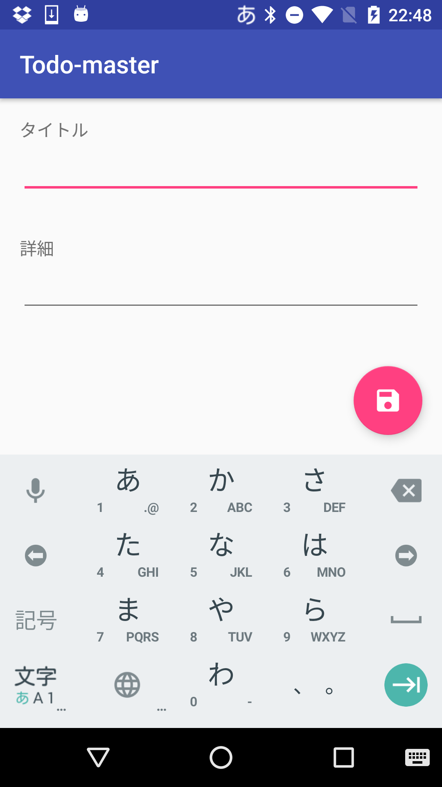

# Todo

## 機能要件
### Phase 1
- Todoを一覧で表示する
  - 作成日順で表示する(Ormaだとデフォルトで追加順なので特にきにする必要はない)
- Todoの詳細を表示する
- Todoを作成し保存する

### Phase 2
- Todoを削除する
- Todoを更新する

### Phase 3
- Todoの並び順を変更する
  - 作成日の昇順/降順
- お気に入り機能を実装する

## モデル
### Todo
| 項目 | 変数名 | 型 |補足|
|---|---|---|---|
|id|id|long||
|タイトル|title|String||
|詳細|description|String||
|作成日|createAt|long||
|更新日|updateAt|long||
|お気に入り|isFavorite|boolean|*chapter 3で追加|

### 画面
|一覧|新規作成|照会|
|---|---|---|
||||

### 備忘録
#### 実装順
- プロジェクト作成
- build.gradleを記載
- packageを作成
    - model
    - presentation
        - list
        - create
        - edit
- model > Todo作成
- list 作成
    - layout
    - adapter
    - activity
        - 画面遷移の処理は作成後に実装
- create
    - layout
    - activity
- show
    - layout
    - activity
